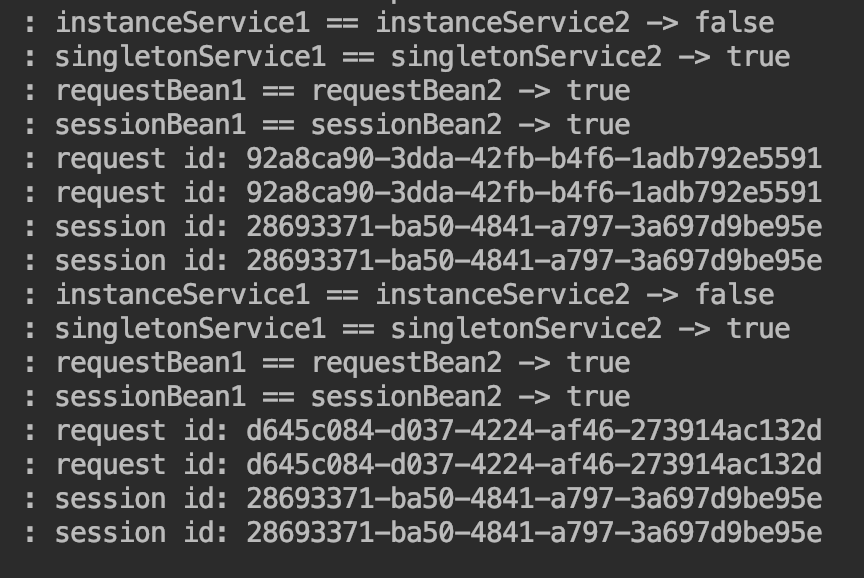
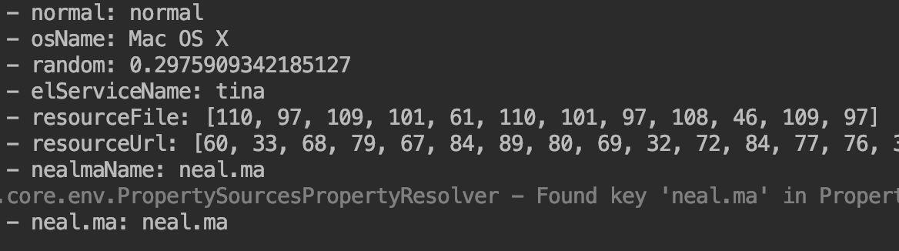

### 2 Spring 常用配置

#### 2.1 Bean 的 Scope

##### 2.1.1 说明
    Scope 是描述 Spring 如何新建 Bean 的实例的。描述的是 实例的生命周期，也可以叫作用域。
    注解 @Scope ， 如下几种方式：
   * Singleton Spring 默认配置，整个 Spring 容器共享一个 Bean 实例。 
   * Prototype Spring 每次调用都新建一个实例。 
   * Request Web 项目中，给每一个 http request 新建一个 Bean 实例。
   * Session Web 项目中，给每一个 http session 新建一个 Bean 实例。
   * GlobalSession 这个只在 potal 应用中，给每一个 global http session 新建一个 Bean 实例。
   * StepScope 在 Spring Batch 中使用 
##### 2.1.2 示例
   **singleton、prototype、request、session**
```
public interface IRequestBean {
    String getId();
}

/**
 * request scope
 * 线程级缓存
 */
@Service
@Scope(value=WebApplicationContext.SCOPE_REQUEST, proxyMode=ScopedProxyMode.INTERFACES)
public class RequestService implements IRequestBean{
    private String id = UUID.randomUUID().toString();
    @Override
    public String getId(){
        return id;
    }
}

public interface ISessionBean {
    String getId();
}

/**
 * session scope
 * 会话级缓存
 */
@Service
@Scope(value=WebApplicationContext.SCOPE_SESSION, proxyMode=ScopedProxyMode.INTERFACES)
public class SessionService implements ISessionBean{
    private String id = UUID.randomUUID().toString();
    @Override
    public String getId(){
        return id;
    }
}

/**
 * singleton
 */
@Service
@Scope("singleton") // 可以不显示使用，Spring 默认配置
public class SingletonService {

}

/**
 * prototype scope
 * 多实例
 */
@Service
@Scope(value = ConfigurableBeanFactory.SCOPE_PROTOTYPE)
@Data
public class InstanceService {

    @Autowired
    private IRequestBean iRequestBean;

    @Autowired
    private ISessionBean iSessionBean;

    @Autowired
    private SingletonService singletonService;
}

/**
 * 测试Controller
 */
@RestController
@Slf4j
public class ScopeRestController {

    @Autowired
    private InstanceService instanceService1;

    @Autowired
    private InstanceService instanceService2;

    @GetMapping("scope/checkScope")
    public List<Object> checkScope() {

        List<Object> list = new ArrayList<>();

        // prototype
        log.info("instanceService1 == instanceService2 -> {}", instanceService1 == instanceService2);

        // singleton
        SingletonService singletonService1 = instanceService1.getSingletonService();
        SingletonService singletonService2 = instanceService1.getSingletonService();
        log.info("singletonService1 == singletonService2 -> {}", singletonService1 == singletonService2);

        // request
        IRequestBean requestBean1 = instanceService1.getIRequestBean();
        IRequestBean requestBean2 = instanceService1.getIRequestBean();
        log.info("requestBean1 == requestBean2 -> {}", requestBean1 == requestBean2);

        // session
        ISessionBean sessionBean1 = instanceService1.getISessionBean();
        ISessionBean sessionBean2 = instanceService1.getISessionBean();
        log.info("sessionBean1 == sessionBean2 -> {}", sessionBean1 == sessionBean2);

        // 每次请求，id都是不一样的
        log.info("request id: {}", instanceService1.getIRequestBean().getId());
        log.info("request id: {}", instanceService2.getIRequestBean().getId());

        // 每次请求，id都是一样，说明一个会话内，id不变
        log.info("session id: {}", instanceService1.getISessionBean().getId());
        log.info("session id: {}", instanceService2.getISessionBean().getId());

        return list;
    }
}

/**
 * main
 */
@SpringBootApplication
@ComponentScan("chapter2.rest,chapter2.scope")
public class App {
    public static void main(String[] args) {
        SpringApplication.run(App.class, args);
    }
}

```


#### 2.2 Spring EL 和 资源调用

   Spring EL 是 Spring 表达式语言，支持在 xml 和 注解中使用表达式。
   开发中经常调用各种资源的场景，包括普通文件、网址、配置文件、系统环境变量等。
* application.properties
```
neal.ma=neal.ma
```

test.properties 
```
name=neal.ma
```
* 代码
```
@Service
@Data
public class ElService {
    private String name = "tina";
}
/**
 * 配置类
 */
@Slf4j
@Configuration
@ComponentScan("chapter2.el")
@PropertySource("application.properties")
public class ElConfig {
    // 注入普通字符串
    @Value("normal")
    private String normal;

    // 注入操作系统属性
    @Value("#{systemProperties['os.name']}")
    private String osName;

    // 注入 表达式结果
    @Value("#{T(java.lang.Math).random()}")
    private double random;

    // 注入其他 Bean 属性
    @Value("#{elService.name}")
    private String elServiceName;

    // 注入文件资源
    @Value("test.properties")
    private Resource resourceFile;

    // 注入网址资源
    @Value("http://www.aliyun.com")
    private Resource resourceUrl;

    // 注入配置文件
    @Value("${neal.ma}")
    private String nealmaName;

    @Autowired
    private Environment environment;

    public void print() throws IOException {
        log.info("normal: {}", normal);
        log.info("osName: {}", osName);
        log.info("random: {}", random);
        log.info("elServiceName: {}", elServiceName);
        log.info("resourceFile: {}", FileCopyUtils.copyToByteArray(resourceFile.getInputStream()));
        log.info("resourceUrl: {}", FileCopyUtils.copyToByteArray(resourceUrl.getInputStream()));
        log.info("nealmaName: {}", nealmaName);
        log.info("neal.ma: {}", environment.getProperty("neal.ma"));
    }
}
```

    
#### 2.3 Bean 的初始化和销毁
    实际开发中，我们会遇到需要在 Bean 的使用前、后做必要操作，Spring 对 Bean 的生命周期提供操作支持。
    
   * Java 配置方式 （@Bean(initMethod="init", destroyMethod="destroy")）
   * JSR-250 注解方式 （@PostConstruct、@PreDestroy）
```

/**
 * bean
 */
@Slf4j
public class BeanWayService {
    public BeanWayService() {
        super();
        log.info("BeanWayService construct");
    }
    public void init(){
        log.info("BeanWayService init");
    }
    public void destroy(){
        log.info("BeanWayService destroy");
    }
}

/**
 * jsr-250
 */
@Slf4j
public class JSR250WayService {
    public JSR250WayService() {
        super();
        log.info("JSR250WayService construct");
    }
    // 构造函数执行完之后执行
    @PostConstruct
    public void init(){
        log.info("JSR250WayService init");
    }

    // 在 Bean 销毁之前执行
    @PreDestroy
    public void destroy(){
        log.info("JSR250WayService destroy");
    }
}


/**
 * pre post config
 */
@Configuration
@ComponentScan("chapter2.propost")
public class PrePostConfig {
    @Bean(initMethod = "init", destroyMethod = "destroy")
    BeanWayService beanWayService(){
        return new BeanWayService();
    }
    @Bean
    JSR250WayService jsr250WayService(){
        return new JSR250WayService();
    }
}

/**
 * main
 */
@Slf4j
public class PrePostRun {

    public static void main(String[] args) {
        AnnotationConfigApplicationContext context = new AnnotationConfigApplicationContext(PrePostConfig.class);

        BeanWayService beanWayService = context.getBean(BeanWayService.class);
        JSR250WayService jsr250WayService = context.getBean(JSR250WayService.class);

        context.close();
        // 输出
        // BeanWayService construct
        // BeanWayService init
        // JSR250WayService construct
        // JSR250WayService init
        // JSR250WayService destroy
        // BeanWayService destroy
    }
}
```
#### 2.4 环境配置 Profile
    Profile 为不同环境提供不同的配置
   * 通过设置 Environment 的 ActiveProfiles 
   * 通过设置 jvm 的 spring.profiles.active 参数（两种：配置文件中；命令行参数）
```
/**
 * Profile
 */
@Data
@AllArgsConstructor
public class ProfileService {
    private String name;
}

/**
 * config
 */
@Configuration
public class ProfileConfig {

    @Bean
    @Profile("test")
    public ProfileService test(){
        return new ProfileService("test");
    }

    @Bean
    @Profile("prod")
    public ProfileService prod(){
        return new ProfileService("prod");
    }
}

/**
 * main
 */
@Slf4j
public class Run {

    public static void main(String[] args) {
    
        AnnotationConfigApplicationContext context = new AnnotationConfigApplicationContext();

        // 激活 test Profile
        context.getEnvironment().setActiveProfiles("test");
        // 注册 Bean 配置类
        context.register(ProfileConfig.class);
        // 刷新容器
        context.refresh();

        ProfileService profileService = context.getBean(ProfileService.class);

        log.info("name: {}", profileService.getName());

        context.close();
        
        // 输出
        // name: test
    }
}
```

#### 2.5 事件（Application Event）

    Spring 事件提供 Bean 与 Bean 之间消息通信。比如一个 Bean 处理完一个任务之后，希望另一个 Bean 感知到并做相应的处理，
    这个时候就需要 这个 Bean 监听另一个 Bean 发送的事件，
   * 自定义事件，继承 ApplicationEvent
   * 定义事件监听器，实现 ApplicationListener 
   * 使用容器发布事件
   
```
/**
 * event
 */
public class MyEvent extends ApplicationEvent {
    private String msg;
    public MyEvent(String msg) {
        super(msg);
        this.msg = msg;
    }

    public String getMsg() {
        return msg;
    }

    public void setMsg(String msg) {
        this.msg = msg;
    }
}

/**
 * listener
 */
@Slf4j
@Component
public class MyEventListener implements ApplicationListener<MyEvent> { // 指定事件类

    // 对消息进行接收处理
    @Override
    public void onApplicationEvent(MyEvent event) {
        log.info("receive: {}", event.getMsg());
    }
}

/**
 * 事件发布类
 */
@Component
public class MyPublisher {

    @Autowired
    private ApplicationContext applicationContext;

    public void publish(MyEvent event){
        applicationContext.publishEvent(event);
    }
}

/**
 * config
 */
@Configuration
@ComponentScan("chapter2.event")
public class EventConfig {

}

/**
 * main
 */
@Slf4j
public class Run {

    public static void main(String[] args) {
        AnnotationConfigApplicationContext context = new AnnotationConfigApplicationContext(EventConfig.class);

        MyPublisher publisher = context.getBean(MyPublisher.class);

        MyEvent event = new MyEvent("tina");
        publisher.publish(event);

        context.close();
        // 输出
        // receive: tina
    }
}
```   
    