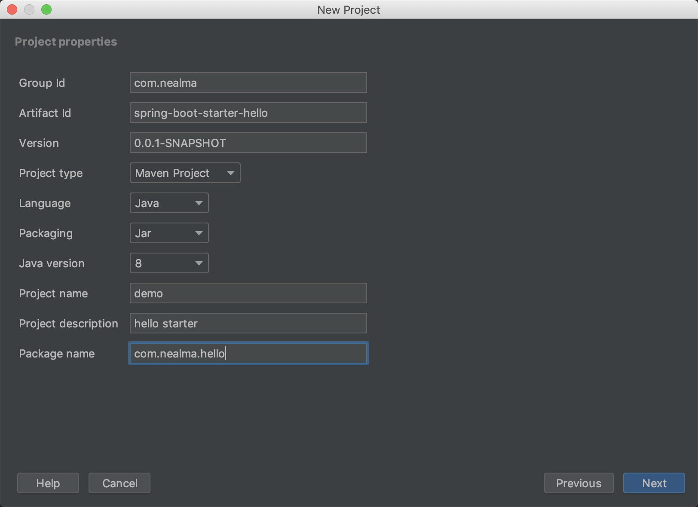
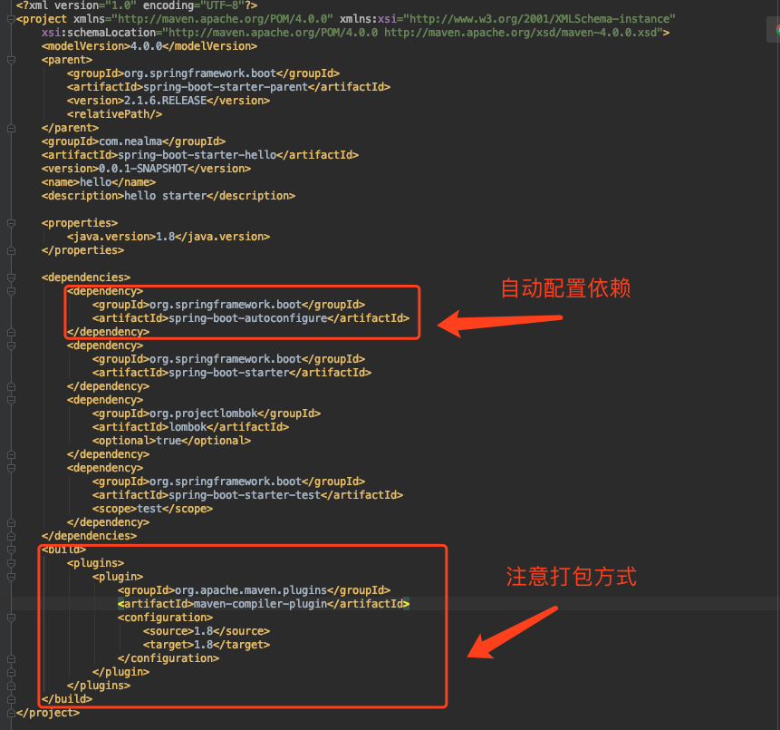
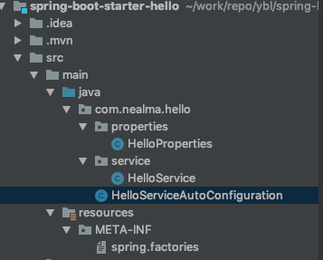

### 6 Spring Boot 运行原理
SpringBoot 基于条件来配置 Bean

#### 查看已启用和未启用的自动配置的报告

* 运行 jar 时增加 --debug 参数
java -jar xxx.jar --debug

* 在 application.properties 中设置属性
```
debug=true
```

* IDEA 的Edit Configurations 中设置 VM options 的参数
```
-Ddebug
```

#### SpringBoot 运作原理
* @SpringBootApplication 是一个组合注解，核心功能是由 @EnableAutoConfiguration 注解提供的
* @EnableAutoConfiguration 中可以看到，主要是 @import 注解 导入的配置功能。

```
@Target(ElementType.TYPE)
@Retention(RetentionPolicy.RUNTIME)
@Documented
@Inherited
@AutoConfigurationPackage
@Import(AutoConfigurationImportSelector.class)
public @interface EnableAutoConfiguration {

	String ENABLED_OVERRIDE_PROPERTY = "spring.boot.enableautoconfiguration";

	/**
	 * Exclude specific auto-configuration classes such that they will never be applied.
	 * @return the classes to exclude
	 */
	Class<?>[] exclude() default {};

	/**
	 * Exclude specific auto-configuration class names such that they will never be
	 * applied.
	 * @return the class names to exclude
	 * @since 1.3.0
	 */
	String[] excludeName() default {};

}
```

AutoConfigurationImportSelector 使用 SpringFactoriesLoader.loadFactoryNames 方法来扫描具有 META-INF/spring.factories 文件的 jar 包。

而我们的 spring-boot-autoconfigure-x.x.x.jar 里就有一个 spring.factories 文件，此文件声明了有哪些自动配置。

#### 核心注解
打开M **ETA-INF/spring.factories** 文件中任意一个AutoConfiguration文件，都会有条件注解 。在 spring-boot-autoconfigure-x.x.x.jar 文件的 org.springframework.boot.autoconfigure.condition 包下面。

主要条件注解
* @ConditionalOnBean 当容器里有指定的 **Bean** 的条件下 当且仅当指定的bean classes and/or bean names在当前容器中,才创建标记上该注解的类的实例
* @ConditionalOnMissingBean 当容器里没有有指定的 **Bean** 的条件下 
* @ConditionalOnClass 当类路径里有指定的 **类** 的条件下 当且仅当ClassPath存在指定的Class时，才创建标记上该注解的类的实例
* @ConditionalOnMissingClass 当类路径里没有指定的 **类** 的条件下
* @ConditionalOnExpression 基于 **SpEL** 表达式作为判断条件 用${..}=false等来表示
* @ConditionalOnJava 基于 **JVM** 版本作为判断条件 指定JDK的版本
* @ConditionalOnJndi 基于 在 **JNDI** 存在的条件下查找指定的位置
* @ConditionalOnWebApplication 在web环境下创建
* @ConditionalOnNotWebApplication 当前项目不是 Web 项目的条件下
* @ConditionalOnProperty 指定的属性是否有指定的值 当且仅当Application.properties存在指定的配置项时，创建标记上了该注解的类的实例
* @ConditionalOnResource classpath下存在指定的resource时创建 Bean
* @ConditionalOnSingleCandidate 当指定 Bean 在容器中只有一个， 或者虽然有多个但是指定首选的 Bean 。

以上注解都是组合了 @Conditional 这个元注解，只是使用了不同的条件。

#### 示例：http 的编码配置

```
@ConfigurationProperties(prefix = "spring.http.encoding")//类型安全的配置 在 application.properties 中读取前缀为 spring.http.encoding 的所有属性
@Data // 使用 lombok
public class HttpEncodingProperties {

    public static final Charset DEFAULT_CHARSET = Charset.forName("UTF-8");

    private Charset charset = DEFAULT_CHARSET;
    private boolean force = true;
}
@Configuration
@EnableConfigurationProperties(HttpEncodingProperties.class)
@ConditionalOnClass(CharacterEncodingFilter.class) // CharacterEncodingFilter 类 在 类路径下
@ConditionalOnProperty(prefix = "spring.http.encoding", value = "enabled", matchIfMissing = true)
// application.properties 中的配置  spring.http.encoding.enabled=false 这种条件下，不会注入 Bean
@Slf4j
public class HttpEncodingAutoConfiguration {

    @Autowired
    private HttpEncodingProperties httpEncodingProperties; // 属性注入, 通过 @EnableConfigurationProperties 声明

    @Bean // java config 方式 注入
    public CharacterEncodingFilter characterEncodingFilter(){
        log.info("characterEncodingFilter -- ");
        CharacterEncodingFilter characterEncodingFilter = new OrderedCharacterEncodingFilter();
        characterEncodingFilter.setEncoding(httpEncodingProperties.getCharset().name());
        characterEncodingFilter.setForceEncoding(httpEncodingProperties.isForce());
        return characterEncodingFilter;
    }
}

```

#### 实战 hello starter pom

* 新建一个 maven 项目



* pom.xml 中 引入 spring-boot-autoconfigure 依赖


* 项目结构


* 新建 HelloProperties.java
```
@ConfigurationProperties(prefix = "hello")
@Data
public class HelloProperties {
    public static final String  MSG = "world";

    private String msg = MSG; // 在 spring.factories 中，获取 hello.msg 的值
}

```
* 新建 HelloService.java
```
@Data
public class HelloService {

    private String msg;

    public String sayHello(){
        return msg;
    }

}
```
* 新建 HelloServiceConfiguration.java
```
@Configuration
@EnableConfigurationProperties(HelloProperties.class)
@ConditionalOnClass(HelloService.class)
@ConditionalOnProperty(prefix = "hello", value = "enabled", matchIfMissing = true)
public class HelloServiceAutoConfiguration {

    @Autowired
    private HelloProperties helloProperties;

    @Bean
    @ConditionalOnMissingBean(HelloService.class)
    public HelloService helloService() {
        HelloService helloService = new HelloService();
        helloService.setMsg(helloProperties.getMsg());
        return helloService;
    }
}
```
* 在 src/main/resource 下 新建 META-INF/spring.factories 文件, 若有多个自动配置，用","隔开，"\"表示换行

```
org.springframework.boot.autoconfigure.EnableAutoConfiguration=\
com.nealma.hello.HelloServiceAutoConfiguration
```

* 使用 starter 
新建项目，引入 maven 依赖
```
<dependency>
    <groupId>com.nealma</groupId>
    <artifactId>spring-boot-starter-hello</artifactId>
    <version>0.0.1-SNAPSHOT</version>
</dependency>
```
* 测试
在 application.properties 文件中添加
```
hello.msg=tina
```
测试类
```
@SpringBootApplication
@RestController
public class Run6 {

    @Autowired
    private HelloService helloService;

    @GetMapping("/hello")
    public String hello(){
        return helloService.sayHello();
    }

    public static void main(String[] args) {
        SpringApplication application = new SpringApplication(Run6.class);
        application.setBannerMode(Banner.Mode.OFF); // 关闭 banner
        application.run(args);
    }
}
```
输出：tina